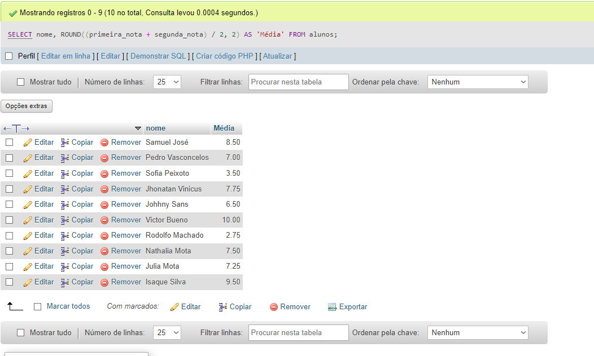

## ETAPA 1: foi feito pela interface do PhpMyAdmin

## ETAPA 2:

```sql

-- Cadastrando 5 Cursos 
INSERT INTO cursos (titulo, carga_horaria)
VALUES
    ('Front-End', 40),
    ('Back-End', 80),
    ('UX/UI Design', 30),
    ('Figma', 10),
    ('Redes de Computadores', 100);

-- Cadastrando 5 Professores
INSERT INTO professor (nome, area_de_atuacao, curso_id)
VALUES
    ('Jon Oliva', 'infra', 5),
    ('Lemmy Kilmister', 'design', 4),
    ('Neil Peart', 'design', 3),
    ('Ozzy Osbourne', 'desenvolvimento', 2),
    ('David Gilmour', 'desenvolvimento', 1);

-- Atualizando os dados da professor_id

UPDATE cursos SET professor_id = 10 WHERE id = 1;
UPDATE cursos SET professor_id =  9 WHERE id = 2;
UPDATE cursos SET professor_id =  8 WHERE id = 3;
UPDATE cursos SET professor_id =  7 WHERE id = 4;
UPDATE cursos SET professor_id =  6 WHERE id = 5; 


-- Adicionando 10 alunos, com duas notas, data de nascimento e nomes.

INSERT INTO alunos (nome, curso_id, primeira_nota, segunda_nota, data_de_nascimento)
VALUES
    ('Samuel José', 1, 8.0, 9.0, '1983-08-10'),
    ('Pedro Vasconcelos', 2, 6.0, 8.0, '1998-07-20'),
    ('Sofia Peixoto', 5, 3.0, 4.0, '1996-11-10'),
    ('Jhonatan Vinicus', 3, 10.0, 5.5, '1999-02-05'),
    ('Johhny Sans', 4, 5.0, 8.0, '1997-09-25'),
    ('Victor Bueno', 2, 10.0, 10.0, '2006-10-27'),
    ('Rodolfo Machado', 5, 2.0, 3.5, '1995-01-12'),
    ('Nathalia Mota', 1, 6.0, 9.0, '1993-10-30'),
    ('Julia Mota', 2, 6.5, 8.0, '2001-01-13'),
    ('Isaque Silva', 3, 9.0, 10.0, '2013-06-26');
```

## ETAPA 3:

```sql
-- Selecionando alunos que nasceram antes de 2009
SELECT nome, data_de_nascimento
FROM alunos
WHERE YEAR(data_de_nascimento) < 2009;
```


```sql
-- Somando as notas e o resultado da média
SELECT nome, ROUND((primeira_nota + segunda_nota) / 2, 2) AS 'Média'
FROM alunos;
```


```sql
-- Calculando o limite de faltas do curso
SELECT titulo, ROUND(carga_horaria * 0.25) AS 'Lmt De Faltas'
FROM cursos
GROUP BY titulo;

```