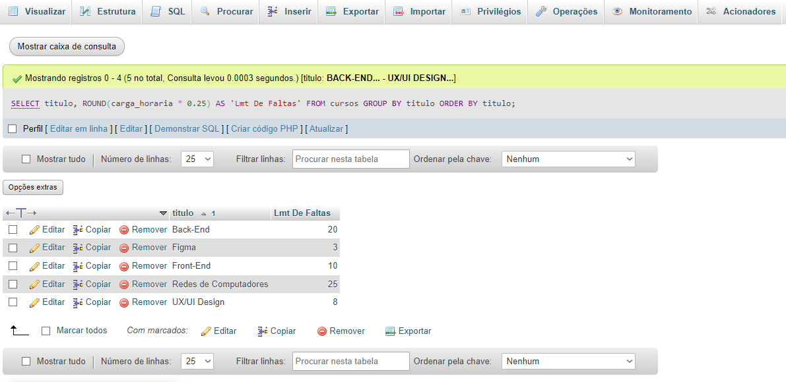
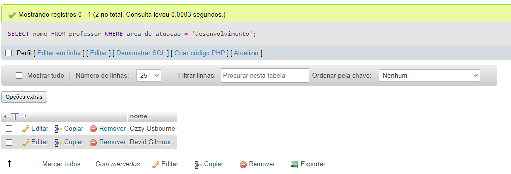
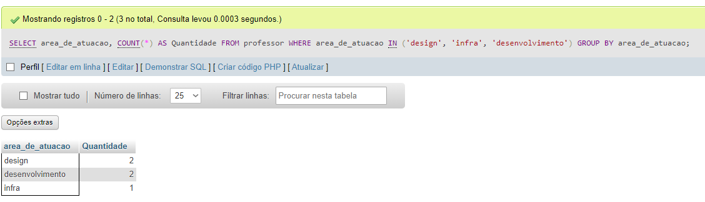
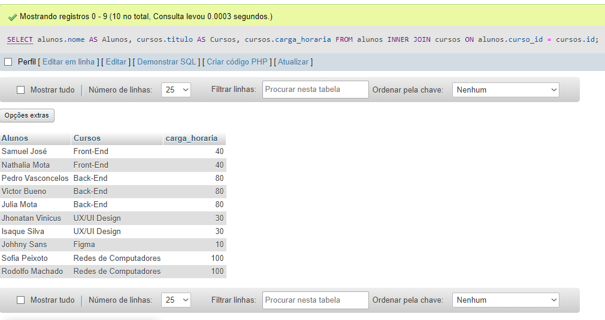
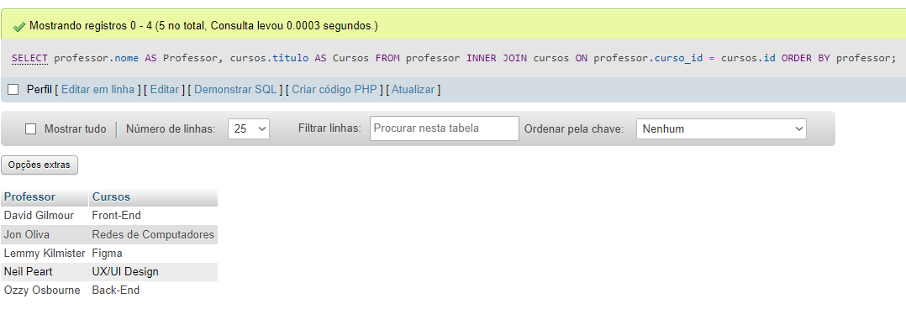
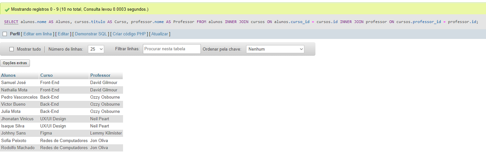
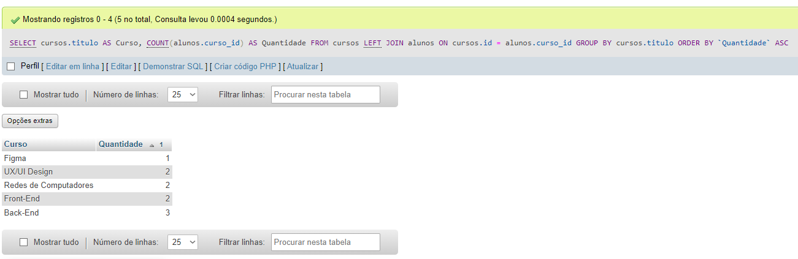
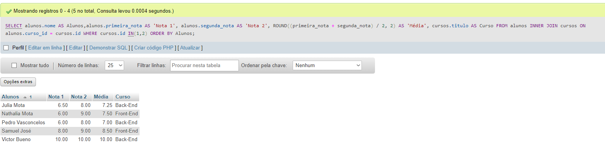
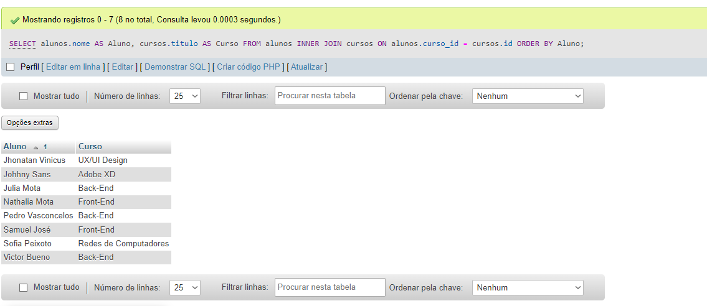

## ETAPA 1: foi feito pela interface do PhpMyAdmin

## ETAPA 2:

```sql

-- Cadastrando 5 Cursos 
INSERT INTO cursos (titulo, carga_horaria)
VALUES
    ('Front-End', 40),
    ('Back-End', 80),
    ('UX/UI Design', 30),
    ('Figma', 10),
    ('Redes de Computadores', 100);

-- Cadastrando 5 Professores
INSERT INTO professor (nome, area_de_atuacao, curso_id)
VALUES
    ('Jon Oliva', 'infra', 5),
    ('Lemmy Kilmister', 'design', 4),
    ('Neil Peart', 'design', 3),
    ('Ozzy Osbourne', 'desenvolvimento', 2),
    ('David Gilmour', 'desenvolvimento', 1);

-- Atualizando os dados da professor_id

UPDATE cursos SET professor_id = 10 WHERE id = 1;
UPDATE cursos SET professor_id =  9 WHERE id = 2;
UPDATE cursos SET professor_id =  8 WHERE id = 3;
UPDATE cursos SET professor_id =  7 WHERE id = 4;
UPDATE cursos SET professor_id =  6 WHERE id = 5; 


-- Adicionando 10 alunos, com duas notas, data de nascimento e nomes.

INSERT INTO alunos (nome, curso_id, primeira_nota, segunda_nota, data_de_nascimento)
VALUES
    ('Samuel José', 1, 8.0, 9.0, '1983-08-10'),
    ('Pedro Vasconcelos', 2, 6.0, 8.0, '1998-07-20'),
    ('Sofia Peixoto', 5, 3.0, 4.0, '1996-11-10'),
    ('Jhonatan Vinicus', 3, 10.0, 5.5, '1999-02-05'),
    ('Johhny Sans', 4, 5.0, 8.0, '1997-09-25'),
    ('Victor Bueno', 2, 10.0, 10.0, '2006-10-27'),
    ('Rodolfo Machado', 5, 2.0, 3.5, '1995-01-12'),
    ('Nathalia Mota', 1, 6.0, 9.0, '1993-10-30'),
    ('Julia Mota', 2, 6.5, 8.0, '2001-01-13'),
    ('Isaque Silva', 3, 9.0, 10.0, '2013-06-26');
```

## ETAPA 3:

```sql
-- Selecionando alunos que nasceram antes de 2009
SELECT nome, data_de_nascimento
FROM alunos
WHERE YEAR(data_de_nascimento) < 2009;
```


```sql
-- Somando as notas e o resultado da média
SELECT nome, ROUND((primeira_nota + segunda_nota) / 2, 2) AS 'Média'
FROM alunos;
```


```sql
-- Calculando o limite de faltas do curso
SELECT titulo, ROUND(carga_horaria * 0.25) AS 'Lmt De Faltas'
FROM cursos
GROUP BY titulo
ORDER BY titulo;
```


```sql
SELECT nome
FROM professor
WHERE area_de_atuacao = 'desenvolvimento';
```


```sql
SELECT area_de_atuacao, COUNT(*) AS Quantidade
FROM professor
WHERE area_de_atuacao IN ('design', 'infra', 'desenvolvimento')
GROUP BY area_de_atuacao;
```


```sql
SELECT alunos.nome AS Alunos, cursos.titulo AS Cursos, cursos.carga_horaria
FROM alunos
INNER JOIN cursos ON alunos.curso_id = cursos.id;
```


```sql
SELECT professor.nome AS Professor, cursos.titulo AS Cursos
FROM professor 
INNER JOIN cursos ON professor.curso_id = cursos.id
ORDER BY professor;
```


```sql
SELECT alunos.nome AS Alunos, cursos.titulo AS Curso, professor.nome AS Professor 
FROM alunos
INNER JOIN alunos ON alunos.curso_id = cursos.id
INNER JOIN cursos ON cursos.curso_id = professores.curso_id
INNER JOIN professores ON professores.professor_id = professores.professor_id;

SELECT alunos.nome AS Alunos, cursos.titulo AS Curso, professor.nome AS Professor 
FROM alunos
INNER JOIN cursos ON alunos.curso_id = cursos.id
INNER JOIN professor ON cursos.professor_id = professor.id;
```


```sql
SELECT cursos.titulo AS Curso, COUNT(alunos.curso_id) AS Quantidade
FROM cursos
LEFT JOIN alunos ON cursos.id = alunos.curso_id
GROUP BY cursos.titulo
ORDER BY Quantidade DESC;
```


```sql
SELECT alunos.nome AS Alunos,alunos.primeira_nota AS 'Nota 1', alunos.segunda_nota AS 'Nota 2', ROUND((primeira_nota + segunda_nota) / 2, 2) AS 'Média', cursos.titulo AS Curso
FROM alunos
INNER JOIN cursos ON alunos.curso_id = cursos.id
WHERE cursos.id IN(1,2)
ORDER BY Alunos;
```


```sql
UPDATE cursos
SET titulo = 'Adobe XD', carga_horaria = 15
WHERE id = 4;
```
## sem print do exercício acima


```sql
DELETE FROM alunos
WHERE (id = 7 AND curso_id = 5) OR
      (id = 10 AND curso_id = 3);
```
## sem print do exercício acima


```sql
SELECT alunos.nome AS Aluno, cursos.titulo AS Curso
FROM alunos
INNER JOIN cursos ON alunos.curso_id = cursos.id
ORDER BY Aluno;
```



### DESAFIOS 

```sql
SELECT nome, DATEDIFF(CURDATE(2,3), data_de_nascimento) / 365 AS idade FROM alunos;
```